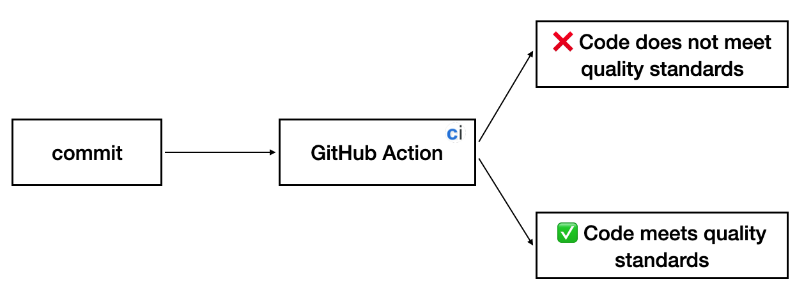
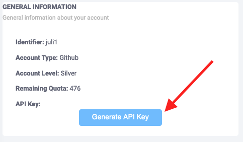
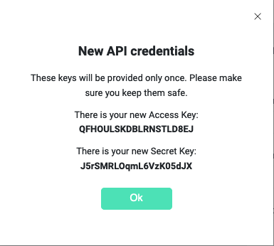
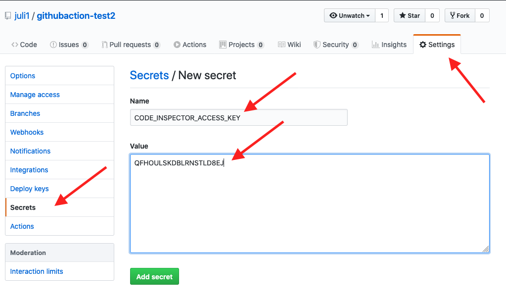
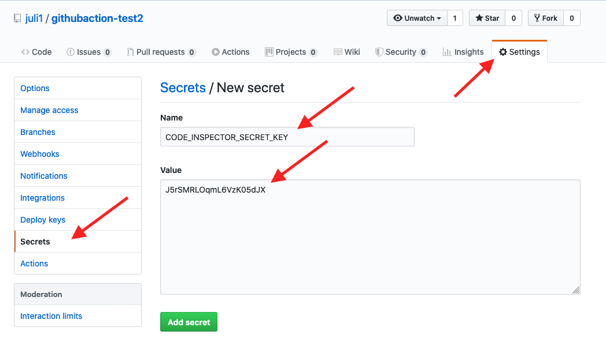
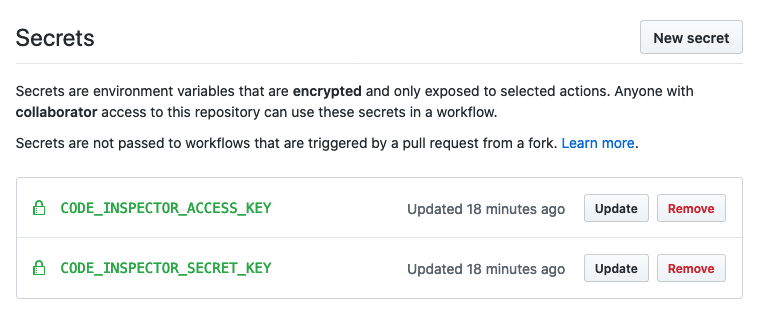

[](https://frontend.code-inspector.com/public/project/8488/github-action/dashboard)
[](https://frontend.code-inspector.com/public/project/8488/github-action/dashboard)

# Code Inspector GitHub Action

## What is it?

The Code Inspector GitHub action allows you to check if your code meets quality criteria.
When a commit is triggered, [Code Inspector](https://www.code-inspector.com) checks
the quality of the source code according to your own metrics threshold.

The action lets you customize the number of metrics based on
 - **Aggregates** (code quality score or grade)
 - **Defects** (code smells detected by static analyzers)
 - **Complex functions** (using cyclomatic complexity)
 - **Long functions** (functions with more than 50 lines of code)



## How to use it?

### Step 1: Get your Code Inspector API keys

Sign up on [Code Inspector](https://www.code-inspector.com).

In your profile, generate API keys.




Once you click on the button, the following window will appear.




### Step 2: Configure your Code Inspector API keys in your GitHub repository

You need to add your Code Inspector API keys into GitHub.

On GitHub, go in your repository settings, click on the secret *Secrets* (on the right) and create a new secret.

Create a secret called `CODE_INSPECTOR_ACCESS_KEY` and set it to the value of the access key generated at the previous step.




Create another secret called `CODE_INSPECTOR_SECRET_KEY` and set it to the value of the secret key generated at the previous step.



Once all secrets have been created, we should have the following secrets generated.




### Step 3: Configure the GitHub action

Create a file `.github/workflows/main.yml` and insert the following
content.

```yaml
on: [push]

jobs:
  check-quality:
    runs-on: ubuntu-latest
    name: A job to check my code quality
    steps:
    - name: Check code meets quality standards
      id: code-inspector
      uses: codeinspectorio/github-action@master
      with:
        repo_token: ${{ secrets.GITHUB_TOKEN }}
        code_inspector_access_key: ${{ secrets.CODE_INSPECTOR_ACCESS_KEY }}
        code_inspector_secret_key: ${{ secrets.CODE_INSPECTOR_SECRET_KEY }}
        min_quality_grade: 'WARNING'
        min_quality_score: '50'
        max_defects_rate: '0.0001'
        max_complex_functions_rate: '0.0001'
        max_long_functions_rate: '0.0001'
        project_name: ''
        max_timeout_sec: '600'
```

The following parameters should *NOT* be changed:

 * **repo_token**: this is how Code Inspector can access your repository
 * **code_inspector_access_key** and **code_inspector_access_key**: this is how the action can communicate with the Code Inspector analysis engine.

The following parameters can be changed:
 * **min_quality_grade**: the minimum grade your project should have. Valid values are: `EXCELLENT`, `GOOD`, `NEUTRAL`, `WARNING`, `CRITICAL`
 * **min_quality_score**: the minimum code quality score your project should have. This is a value between `0` and `100`.
 * **max_defects_rate**: the number of defects per line of code. For example, the value `0.001` means 1 defect per 1000 lines of codes.
 * **max_complex_functions_rate**: the rate of complex functions (e.g. functions with high cyclomatic complexity). 
   For example, a value of `0.5` means that the code should not have more than 50% of functions with high complexity.
 * **max_long_functions_rate**: the rate of long functions (e.g. functions that are too long to be correctly read by developers). 
   For example, a value of `0.4` means that the code should not have more than 40% of long functions.
 * **project_name**: the name of the project on [Code Inspector](https://www.code-inspector.com). This argument is optional:
   if you set a project name, the analysis engine will use the preferences of this project. Leave blank for not using a project.
 * **max_timeout_sec**: how many seconds the analysis should come back to you. Default is 600 secconds (10 minutes.)

### Step 4: Enjoy while drinking ☕

Everything is set up 🎉

Add a new commit and the Code Inspector engine will check if the new code meets your criteria.

To visualize the results details, you can can use the [frontend](https://frontend.code-inspector.com),
our [command-line client](https://github.com/codeinspectorio/citool) 
or use directly our [API](https://doc.code-inspector.com/docs/api/).


# Automated Code Reviews

This GitHub action is about checking the code quality at every commit or pull request. If you want to have
automated Code Reviews, Code Inspector supports automated code reviews with [its GitHub app](https://github.com/marketplace/code-inspector).


# Contact and bug reports

Feel free to open an issue on this GitHub project.
If you have questions related to Code Inspector itself, please
contact [the support team](https://www.code-inspector.com/contact)